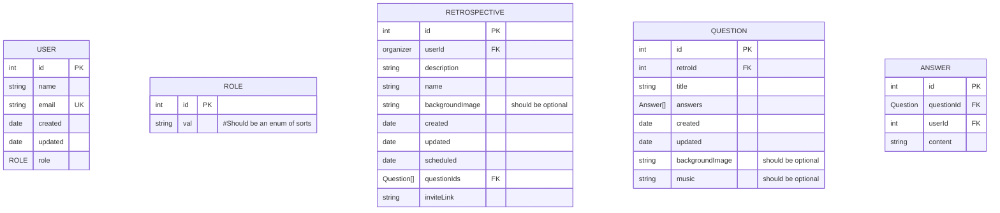

# ER Diagram

```mermaid
erDiagram
  USER {
    int id PK
    string name
    string email UK
    date created
    date updated
    ROLE role
  }

  ROLE {
    int id PK
    string val "#Should be an enum of sorts"
  }

  RETROSPECTIVE {
    int id PK
    organizer userId FK
    string description
    string name
    string backgroundImage "should be optional"
    date created
    date updated
    date scheduled
    Question[] questionIds FK
    string inviteLink
  }

  QUESTION {
    int id PK
    int retroId FK
    string title
    Answer[] answers
    date created
    date updated
    string backgroundImage "should be optional"
    string music "should be optional"
  }

  ANSWER {
    int id PK
    Question questionId FK
    int userId FK
    string content
  }
```
